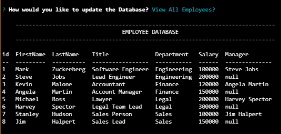

  
  
  # Employee-Tracker
  

  ## Table Of Contents

  * [Description](#description)

  * [Installation](#installation)

  * [Usage](#usage)

  * [License](#license)

  * [Contributors](#contributors)

  * [Tests](#tests)

  * [ScreenShots](#screenshots)

  * [Links](#links)

  * [Questions](#questions)

  ## Description

  This is a Content Management System Application that is run on the command line. After the user inputs employee data, tables are created using MySql to display and update data. The user is able to modify the data as well as add or delete values. 
  
  ## Installation

  To run this application properly, you need to install 
  * Node.js 
  * NPM 
  * MySql
  * Inquirer
  

  ## Usage
  
  * Clone from the GitHub Repository 
  * Open the Command Line and navigate to project folder
  * Enter the command npm i
  * After all the packages download, Enter the command npm start 
  * Follow the Prompts to input employee data
  
  
  ## License
  
  This Project is licensed by [MIT](https://choosealicense.com/licenses/mit/).
  
  ## Contributors
  
  The following helped make this project possible:

  Tom Lazore -  Contact Info Below
  
  
  ## Tests
  
  To test this application, enter Enter Inputs to test Validation in the command line

  ## ScreenShot

  

  ## Links

  Video Walkthrough: https://drive.google.com/file/d/14Pu4p2aSdc36I4JdvaVQMrEevlJKx_Xu/view

  Project Repository: https://github.com/tlaze/Employee-Tracker
  
  
  ## Questions

  If you have any questions, comments, or issues feel free to contact Tom Lazore directly through
  
  email: tomlazore@gmail.com

  or check out my [GitHub](https://github.com/tlaze)

  
